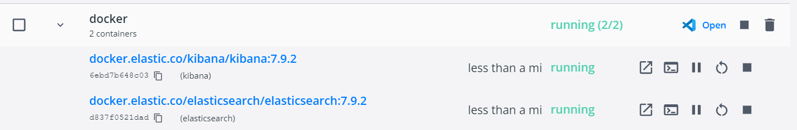

# .NET and Logging Mock Project
A project that demos the visualization and filtering capabilities of Kibana and ElasticSearch with regards to logging using Serilog for an ASP.NET application.

Recreated and updated by Camryn Friedman 06/27/2022.

*Original source: https://www.humankode.com/asp-net-core/logging-with-elasticsearch-kibana-asp-net-core-and-docker/*

*Disclaimer: This project uses Docker, so it cannot be run on the BBY VDI.*

**Requirements:**
- Docker
- Visual Studio Code
- .NET Core SDK 3.1 or later

## Generated Links
- <localhost:5601> - Kibana
- <localhost:5106> - The page found at `Views/Home/Index.cshtml`
- <localhost:9200> - Elasticsearch 

## Steps to Run
1. Get the Kibana and Elasticsearch containers up and running (in project folder):
    ```
    cd docker
    docker-compose up -d
    ```
2. Check that Kibana and Elasticsearch are up and running either...
    - by opening the Docker application and looking for "running" as seen here: 
    
    or,
    - by navigating to <localhost:5601>, <localhost:5106>, and <localhost:9200>
3. Navigate out of the docker directory (`cd ..`) and run the program: `dotnet run`
4. View the logs on [Kibana](localhost:5601) by navigating to the site, clicking the sidebar on the left, pressing "Kibana" -> "Discover".
5. To filter logs by message, for example, type `message: "HomeController Index"` in the search bar.

## Deviations from Source
- The source notes to use the following command when creating the project: `dotnet new mvc --no-https -o <ProjectName>`. Later on, it was found that with .NET 6, the `Startup.cs` file is no more. However, the project's source code depends on the use of `Startup.cs` (see [Program.cs](Program.cs) line 69). To overcome this issue, I simply went to the source's repo and copied the Startup.cs file found there and put it into my project.
- The source notes to use <localhost:5000> to launch the site, but this is incorrect.